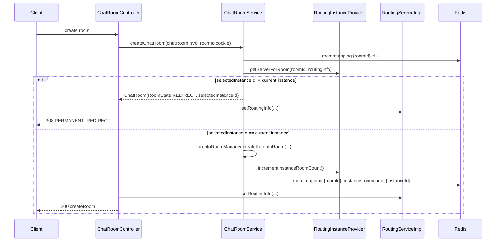

> 관련 문서: [README](./README.md) | [WEBRTC_ROOM_LIFECYCLE](./WEBRTC_ROOM_LIFECYCLE.md) | [RECORDING_FLOW](./RECORDING_FLOW.md)

Last verified against code: 2026-05-21

# Room Routing Flow — 다중 인스턴스 라우팅 명세

다중 인스턴스 환경에서 RTC 방이 소유 인스턴스로 라우팅되는 현재 구현 기준 흐름이다. 방 생성, 방 입장, nginx sticky cookie, Redis mapping, Kafka lifecycle 이벤트를 코드 기준으로 추적한다.

---

## 1. 구성 요소

| 컴포넌트 | 역할 |
|---------|------|
| `RoutingInstanceProvider` | 방 생성 시 `getServerForRoom()`으로 배정 인스턴스 결정 |
| `InstanceProvider` | Consistent Hash ring, active server, lifecycle Kafka 이벤트 처리 |
| `RoutingBootstrapCoordinator` | local routing state 초기화, listener readiness 대기, cluster announce, cookie 수집 순서 조율 |
| `CookieCheckEvent` | nginx sticky cookie 수집 및 인스턴스 cookie Redis 저장 |
| `RoutingServiceImpl` | 방 routing mapping 저장, sticky cookie와 redirect cookie 설정 |
| `ChatRoomService` | 방 생성, 방 삭제, instance room count 증감 |
| `ChatRoomController` | 방 생성/입장 HTTP 응답과 redirect 결과 반환 |

---

## 2. nginx Sticky Session 쿠키

| 쿠키 이름 | 값 | 속성 | 역할 |
|----------|-----|------|------|
| `chatforyou-server` | nginx upstream sticky 값 | `HttpOnly`, `Secure`, `SameSite=None`, `Max-Age=86400` | 특정 Pod로 요청 고정 |
| `room-id` | roomId | `Secure`, `SameSite=None`, `Max-Age=60` | 방 생성 redirect 재요청 시 같은 roomId 유지 |
| `room-redirect-count` | 정수 | `HttpOnly`, `Secure`, `SameSite=None`, 기본 `Max-Age=60` | redirect loop 방지 |

`chatforyou-server` 쿠키가 없으면 nginx는 임의 Pod로 요청을 보낼 수 있다. 방 라우팅의 핵심은 방을 소유한 Pod의 nginx cookie 값을 클라이언트에 심어 다음 요청을 owner instance로 보내는 것이다.

---

## 3. Redis Key 구조

| Key 패턴 | 값 타입 | 설명 |
|---------|---------|------|
| `room:mapping:{roomId}` | `RoomRoutingInfo` | 방별 owner instanceId와 nginx cookie |
| `instance:roomcount:{instanceId}` | `Long` | 부하 분산용 인스턴스별 방 수 |
| `instance:cookie:{instanceId}` | `String` | 인스턴스별 nginx sticky cookie |
| `instance:heartbeat:{instanceId}` | timestamp | 인스턴스 생존 신호 |

---

## 4. Kafka Topic

| Topic | 사용 흐름 |
|-------|-----------|
| `server-lifecycle-events` | 서버 discovery, started/stopped, cookie request/response/discovered |
| `room-events` | 방 생성/삭제/설정 변경/user count 변경 이벤트를 SSE로 전달 |

`server-lifecycle-events`는 routing cluster membership과 cookie discovery에 사용된다. 방 목록 갱신용 SSE 흐름은 `ChatKafkaProducer`와 `ChatRoomEventConsumer`가 `room-events` topic을 사용한다.

---

## 5. Bootstrap 기동 순서

`RoutingBootstrapCoordinator.onApplicationReady()`는 다음 순서로 실행된다.

```text
1. instanceProvider.initializeLocalRoutingState()
2. instanceProvider.awaitServerLifecycleListenerReady(timeout)
3. instanceProvider.announceClusterPresence()
4. cookieCheckEvent.collectOwnCookie()
```

Kafka listener readiness timeout이 발생해도 startup을 중단하지 않고 cluster announce와 cookie 수집을 계속 진행한다.

---

## 6. Cookie 수집 흐름

`CookieCheckEvent.collectOwnCookie()`는 로컬 모드와 클러스터 모드를 나눠 처리한다.

### Local mode
- `cookie.check.domain`이 비어 있으면 `local_cookie|{instanceId}`를 `instance:cookie:{instanceId}`에 저장하고 완료한다.

### Cluster mode
1. 다른 Pod가 알고 있는 cookie를 Kafka로 요청한다.
2. peer 응답이 없으면 `/chatforyou/api/health/cookie` 요청을 반복해 확률적으로 자신의 nginx cookie를 수집한다.
3. 수집한 cookie를 검증한 뒤 `instance:cookie:{instanceId}`에 저장한다.
4. `SERVER_COOKIE_DISCOVERED` 이벤트로 다른 Pod에 알린다.

---

## 7. 방 생성 흐름

Endpoint: `POST /chatforyou/api/chat/room`



현재 인스턴스가 선택 인스턴스가 아니면 방을 실제 생성하지 않고 `RoomState.REDIRECT` 상태의 응답 객체를 반환한다. Controller는 routing cookie를 설정한 뒤 HTTP `PERMANENT_REDIRECT`를 반환한다.

현재 인스턴스가 owner이면 Kurento 방을 생성하고 방 count를 증가시키며, 방 생성 이벤트를 SSE/Kafka 흐름으로 발행한다.

---

## 8. 방 입장 흐름

Endpoint: `GET /chatforyou/api/chat/room/{roomId}`

1. Firebase token과 Redis login user를 검증한다.
2. Redis에서 `ChatRoom`을 조회한다. 없으면 `ROOM_NOT_FOUND = R001` 예외를 던진다.
3. 비밀방이면 `X-Room-Token`을 검증한다.
4. `chatRoom.instanceId`가 없거나 owner instance가 unhealthy이면 `chatRoomService.delChatRoom(roomId, true)`로 비활성화하고 `REDIRECT_DASHBOARD`를 반환한다.
5. 현재 인스턴스가 owner가 아니면 `room:mapping:{roomId}`를 조회한다.
6. `room-redirect-count > 3`이면 추가 재배정 없이 `REDIRECT_DASHBOARD`를 반환한다.
7. redirect count가 3 이하이면 owner nginx cookie를 설정하고 `REDIRECT_ROOM`을 반환한다.
8. 현재 인스턴스가 owner이면 방 타입에 따라 입장 성공 응답을 반환한다.

입장 흐름에서 `room-redirect-count > 3`이 되면 현재 인스턴스로 강제 재배정하지 않고 dashboard redirect 응답을 반환한다. 방 생성 redirect cookie 설정 경로와 방 입장 redirect 처리 흐름은 분리되어 있다.

---

## 9. Health Endpoints

| 엔드포인트 | 동작 |
|-----------|------|
| `GET /chatforyou/api/health/cookie` | 현재 instanceId를 응답하고 cookie 수집 검증에 사용 |
| `GET /chatforyou/api/health/readiness` | cookie 수집 전에는 503, 수집 후 200 |
| `GET /chatforyou/api/health/liveness` | liveness probe 용도 |

---

## 10. 주요 코드 위치

```text
springboot-backend/src/main/java/webChat/
├── controller/ChatRoomController.java
├── controller/HealthController.java
├── model/redis/RedisKeyPrefix.java
├── model/kafka/KafkaTopic.java
├── service/chatroom/ChatRoomService.java
├── service/routing/InstanceProvider.java
├── service/routing/RoutingBootstrapCoordinator.java
├── service/routing/RoutingInstanceProvider.java
├── service/routing/CookieCheckEvent.java
├── service/routing/impl/RoutingServiceImpl.java
└── service/kafka/ChatKafkaProducer.java
```
