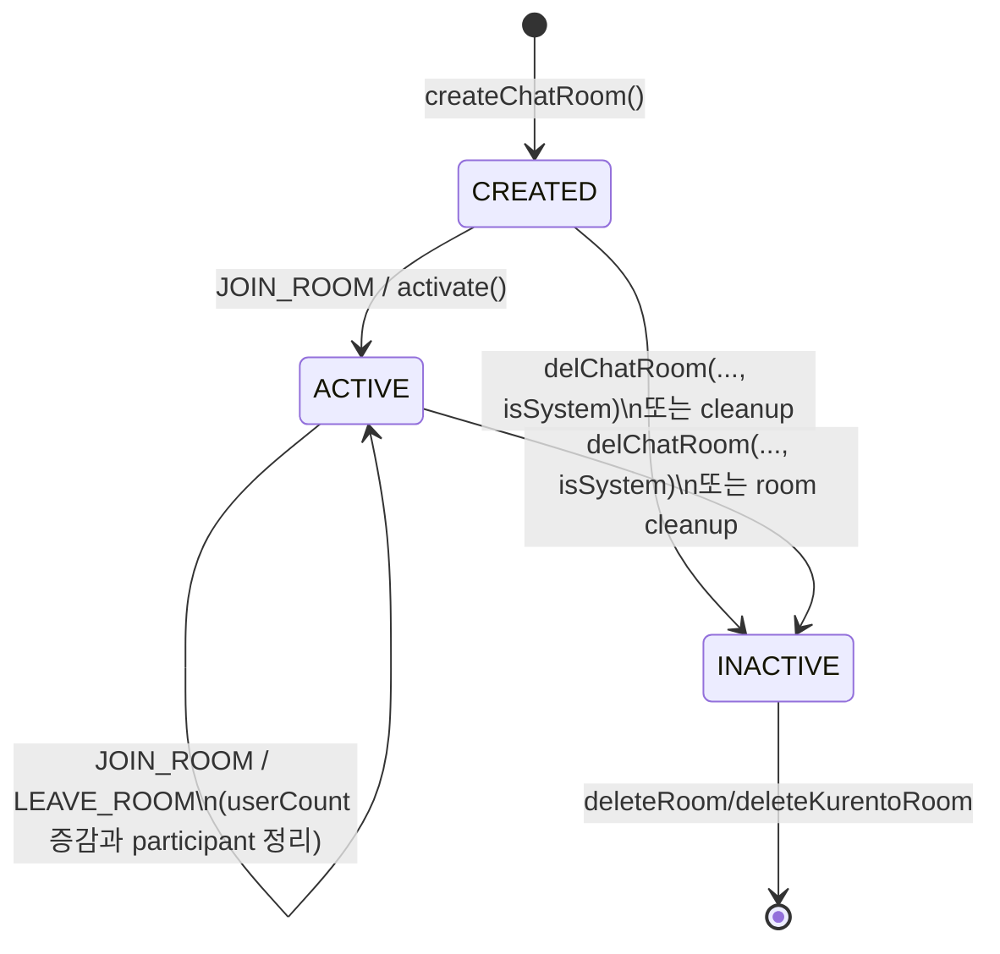

> 관련 문서: [README](./README.md) | [ROOM_ROUTING_FLOW](./ROOM_ROUTING_FLOW.md) | [RECORDING_FLOW](./RECORDING_FLOW.md)

Last verified against code: 2026-05-21

# WebRTC Room Lifecycle — 상태 전이 명세

`JOIN_ROOM`부터 WebSocket 종료 정리까지의 현재 구현 기준 상태 전이를 정리한다. 이 문서는 WebRTC, Kurento, 세션 교체, 녹화 상태 흐름을 코드 기준으로 추적하기 위한 참조 문서다.

---

## 1. 상태 필드 정의

### Redis 저장 상태

| 필드 | 타입 | 의미 |
|------|------|------|
| `roomState` | `CREATED` / `ACTIVE` / `INACTIVE` | 방 활성화 단계 |
| `isKurentoInitialized` | `boolean` | Kurento 자원 초기화 여부 |
| `isRecordingInProgress` | `boolean` | 녹화 진행 중 여부 |
| `hasRecordedOnce` | `boolean` | 한 번 녹화가 시작되었는지 여부 |
| `recordingInfo` | `RecordingInfo` | 현재/마지막 녹화 메타데이터 |
| `userCount` | `int` | Redis 방 참가자 수 |

### In-memory 상태

| 필드 | 위치 | 의미 |
|------|------|------|
| `kurentoPipelineMap` | `KurentoRoomManager` | 방별 `MediaPipeline` |
| `KurentoCompositeMap` | static map | 녹화용 `Composite` |
| `KurentoRecorderMap` | static map | 녹화용 `RecorderEndpoint`와 recorder `HubPort` |
| `roomParticipants` | `KurentoParticipantRepository` | roomId와 userId 기준 참가자 |
| `usersBySessionId` | `KurentoParticipantRepository` | WebSocket sessionId 기준 참가자 역색인 |

### `KurentoUserSession` 주요 필드

| 필드 | 의미 |
|------|------|
| `outgoingMedia` | 자신의 WebRTC 송출 endpoint |
| `incomingMedia` | 발신자 userId별 수신 endpoint |
| `textOverlayFilter` | 자막/텍스트 오버레이 필터 |
| `compositeScaler` | 녹화 Composite 연결 전 스케일링 필터 |
| `compositeHubPort` | 녹화 Composite 연결 포트 |

---

## 2. Room 상태 전이



현재 구현에서 마지막 참가자 퇴장만으로 `roomState`가 `INACTIVE`가 되지는 않는다. `LEAVE_ROOM`은 참가자 제거, `userCount` 감소, peer 알림, Kurento session cleanup만 수행한다. `INACTIVE` 전환은 `ChatRoomService.delChatRoom(..., isSystem)` 또는 방 cleanup 경로에서 수행된다.

---

## 3. WebSocket 메시지와 이벤트명

| 코드 enum 또는 흐름 | 클라이언트 메시지 id |
|--------------------|---------------------|
| 신규 참가자 입장 알림 | `newParticipantArrived` |
| 참가자 퇴장 알림 | `participantLeft` |
| 기존 참가자 목록 | `existingParticipants` |
| 본인 중복 세션 교체 알림 | `sessionReplaced` |
| peer에게 같은 userId 세션 교체 알림 | `participantSessionReplaced` |
| SDP answer | `receiveVideoAnswer` |
| ICE candidate | `iceCandidate` |
| 녹화 시작 성공 | `recordingStarted` |
| 녹화 중지 성공 | `recordingStopped` |
| 업로드 완료 | `uploadCompleted` |
| 자동 종료 | `recordingAutoStopped` |

---

## 4. Error Code

| 상황 | ErrorCode | code |
|------|-----------|------|
| 방 없음 | `ROOM_NOT_FOUND` | `R001` |
| 접근 권한 없음 | `ACCESS_DENIED` | `A001` |
| 이미 녹화 중 | `ALREADY_RECORDING` | `K001` |
| 녹화 중이 아님 | `NOT_RECORDING` | `K002` |
| 녹화 endpoint 또는 정보 없음 | `RECORDING_ENDPOINT_NOT_FOUND` | `K003` |
| 이미 녹화 파일 존재 | `RECORDING_FILE_EXISTS` | `K004` |

---

## 5. 이벤트별 상태 전이

### 5.1 `JOIN_ROOM`

처리 위치: `KurentoHandler.joinRoom()`, `KurentoRoomManager.join()`

1. Redis에서 `KurentoRoom`을 조회한다. 없으면 `ROOM_NOT_FOUND = R001`.
2. `kurentoRoom.getKurento()`가 없으면 `KurentoClient`를 설정한다.
3. `kurentoPipelineMap`에 방 pipeline이 없으면 생성한다.
4. `kurentoRoom.activate()`로 `CREATED -> ACTIVE` 전환을 수행한다.
5. `KurentoRoomManager.join()`으로 신규 참가자 또는 replacement 참가자를 등록한다.
6. `KurentoJoinResult.replacedExistingParticipant()`가 `false`일 때만 Redis `userCount`를 증가시키고 `room-events` user count 이벤트를 발행한다.
7. 녹화 중이면 신규 참가자에게 `recordingInProgress` 메시지를 보낸다.
8. 이미 녹화 파일이 있으면 `recordingFileExistsError`를 보낸다.

#### 신규 참가자

1. `KurentoUserSession` 생성 및 `outgoingMedia`, `textOverlayFilter` 준비
2. `roomParticipants`와 `usersBySessionId` 등록
3. 녹화 중이면 Composite 연결
4. 기존 참가자에게 `newParticipantArrived` 알림
5. 신규 참가자에게 `existingParticipants` 전송

#### 같은 userId 세션 교체

1. 기존 세션에 `sessionReplaced` 전송
2. 기존 세션의 peer incoming endpoint 정리
3. 기존 세션의 Composite 연결 해제
4. 신규 세션을 participant repository에 등록
5. 기존 세션 자원 close
6. 신규 세션을 Composite에 연결
7. peer에게 `participantSessionReplaced` 알림
8. 신규 세션에 `existingParticipants` 전송

세션 교체는 동일 userId의 replacement이므로 Redis `userCount`를 증가시키지 않는다.

---

### 5.2 `RECEIVE_VIDEO_FROM`

처리 위치: `KurentoHandler.processReceiveVideo()`, `KurentoUserSession.receiveVideoFrom()`

1. 수신자와 발신자 `KurentoUserSession`을 조회한다.
2. 수신자는 `getEndpointForUser(sender)`로 SDP offer 처리 대상 endpoint를 가져온다.
3. `processOffer()`로 SDP answer를 생성한다.
4. 클라이언트에 `receiveVideoAnswer`를 보낸다.
5. `gatherCandidates()`를 호출한다.

미디어 연결 규칙:

- `senderId == receiverId`: loopback이므로 `outgoingMedia`를 재사용한다.
- 다른 참가자: 새 `incomingMedia`가 필요하면 생성하고 `sender.textOverlayFilter -> incomingMedia`로 연결한다.
- `textOverlayFilter` 연결 예외 시 `sender.outgoingMedia -> incomingMedia`로 폴백한다.

---

### 5.3 `ON_ICE_CANDIDATE`

처리 위치: `KurentoHandler.processIceCandidate()`

| candidate 대상 | endpoint |
|----------------|----------|
| 자신 | `outgoingMedia` |
| 상대방 | `incomingMedia.get(senderId)` |

상대방용 `incomingMedia`가 아직 없으면 candidate는 무시된다.

---

### 5.4 `LEAVE_ROOM`

처리 위치: `KurentoHandler.leaveRoom()`, `KurentoRoomManager.leave()`

1. `isCurrentParticipantSession(roomId, userId, session)`으로 현재 session인지 먼저 확인한다.
2. 현재 참가자 세션과 일치하지 않으면 `removeSessionMappingIfMatched(session, user)`만 수행하고 반환한다. 신규 세션의 `usersBySessionId` 매핑은 유지된다.
3. 방이 이미 없으면 session 역색인만 조건부 제거하고 반환한다.
4. 참가자가 현재 방 participant map에 없으면 반환한다.
5. 녹화 중이고 Composite에 연결되어 있으면 먼저 Composite 연결을 해제한다.
6. `removeParticipant(roomId, userId)`로 `roomParticipants`와 `usersBySessionId`를 정리한다.
7. 남은 참가자들의 `incomingMedia`에서 퇴장 사용자의 endpoint를 제거한다.
8. 남은 참가자에게 `participantLeft` 메시지를 보낸다.
9. `KurentoUserSession.close()`로 퇴장 참가자의 자원을 해제한다.
10. Redis `userCount`를 감소시키고 `room-events` user count 이벤트를 발행한다.

마지막 참가자 퇴장 여부와 관계없이 이 흐름은 `roomState`를 직접 `INACTIVE`로 바꾸지 않는다.

---

### 5.5 `TEXT_OVERLAY`

처리 위치: `KurentoHandler.processTextOverlay()`, `KurentoUserSession.applyTextOverlay()`

1. 참가자의 `textOverlayFilter.text` property를 설정한다.
2. 비동기 작업으로 일정 시간 후 텍스트를 초기화한다.

상태 변경은 filter 내부 property에 한정된다.

---

### 5.6 `RECORDING_START`

처리 위치: `KurentoHandler.processRecordingStart()`, `RecordingService.startRecording()`, `KurentoRoom.startRoomRecording()`

1. `hasRecordedOnce == true`이면 `RECORDING_FILE_EXISTS = K004`.
2. `isRecordingInProgress == true`이면 `ALREADY_RECORDING = K001`.
3. `room.initUserHubPort()`로 `Composite`를 준비한다.
4. 기존 참가자를 Composite에 연결한다.
5. `RecorderEndpoint`를 생성하고 `record()`를 호출한다.
6. `hasRecordedOnce = true`, `isRecordingInProgress = true`로 변경한다.
7. `recordingInfo`를 저장하고 자동 종료 작업을 예약한다.

---

### 5.7 `RECORDING_STOP`

처리 위치: `KurentoHandler.processRecordingStop()`, `RecordingService.stopRecording()`, `KurentoRoom.stopRoomRecording()`

1. 녹화 중이 아니면 `NOT_RECORDING = K002`.
2. 녹화 정보가 없으면 `RECORDING_ENDPOINT_NOT_FOUND = K003`.
3. 요청자 userId가 `recordingInfo.recordingUserId`와 다르면 `ACCESS_DENIED = A001`.
4. 자동 종료 작업을 취소한다.
5. `RecorderEndpoint.stopAndWait()`를 호출한다.
6. recorder 자원을 정리하고 `isRecordingInProgress = false`로 변경한다.
7. 모든 참가자의 Composite 연결을 해제한다.
8. 비동기 업로드를 시작한다.

`hasRecordedOnce`는 `true`로 유지되어 같은 방에서 재녹화를 막는다.

---

### 5.8 WebSocket 종료 정리

처리 위치: `KurentoHandler.afterConnectionClosed()`

정상 종료와 비정상 종료 모두 WebSocket close 이후 `afterConnectionClosed()`에서 sessionId 기준 참가자를 찾고, 매핑이 있으면 `leaveRoom()`으로 위임한다.

1. `participantService.getBySessionId(session)`으로 참가자를 조회한다.
2. 매핑이 없으면 조용히 반환한다.
3. 매핑이 있으면 `leaveRoom(user)`를 호출한다.
4. `leaveRoom()` 내부 세션 일치성 검사를 거쳐 최신 참가자 세션만 정리한다.

---

## 6. `KurentoUserSession.close()` cleanup 순서

`KurentoUserSession.close()` 자체가 수행하는 순서는 다음과 같다.

| 순서 | 자원 |
|------|------|
| 1 | 모든 `incomingMedia` endpoint release |
| 2 | `textOverlayFilter` release |
| 3 | `compositeScaler`와 `compositeHubPort` release |
| 4 | `outgoingMedia` endpoint release |
| 5 | WebSocket session close |

`usersBySessionId` 제거는 `KurentoUserSession.close()`가 아니라 repository/service 레이어가 담당한다.

- 참가자 제거: `KurentoParticipantRepository.removeParticipant()`
- 방 전체 제거: `KurentoParticipantRepository.removeRoom()`
- sessionId 조건부 제거: `removeSessionMappingIfMatched()`

---

## 7. 세션 일관성 처리

| 케이스 | 처리 방법 | 관련 위치 |
|--------|-----------|-----------|
| 같은 userId 중복 join | `KurentoJoinResult`로 신규 join과 replacement를 구분 | `KurentoRoomManager.join()` |
| sessionId 일치성 검증 | `isCurrentParticipantSession()` 후 `removeSessionMappingIfMatched()` | `KurentoHandler.leaveRoom()` |
| sessionId 역색인 정리 | `removeParticipant`, `removeRoom`, 조건부 session mapping 제거 | `KurentoParticipantRepository` |
| 동시 WebSocket 송신 | `synchronized(session)` | `KurentoMessageSender`, `KurentoUserSession` |
| 녹화 중복 시작 | `hasRecordedOnce`, `isRecordingInProgress` 검사 | `KurentoHandler.processRecordingStart()` |
| 녹화 중지 권한 | `recordingInfo.recordingUserId`와 요청자 userId 비교 | `KurentoHandler.processRecordingStop()` |

---

## 8. 주요 코드 위치

```text
springboot-backend/src/main/java/webChat/
├── service/kurento/KurentoHandler.java
├── service/kurento/KurentoRoomManager.java
├── service/kurento/KurentoUserSession.java
├── service/kurento/KurentoJoinResult.java
├── repository/kurento/participant/KurentoParticipantRepository.java
├── service/chatroom/participant/impl/KurentoParticipantServiceImpl.java
├── model/room/KurentoRoom.java
├── model/kurento/KurentoMessageType.java
├── exception/ErrorCode.java
└── service/recording/RecordingService.java
```
